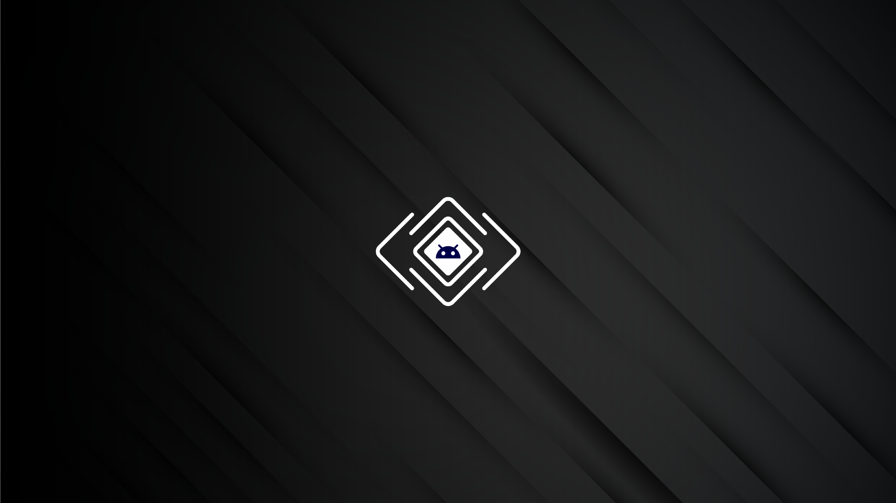

  

<h2 align="center">QuickTips On Web</h2>

 Now you can find all of my content in one place. You can watch videos as well as find information about extensions here <a href="https://zainulhassan815.github.io/quicktips/">QuickTips</a> 

## ⛏️ Built Using 

- HTML
- CSS
- JavaScript

## ✍️ Authors 

- [@zainulhassan](https://github.com/zainulhassan) - Idea & Initial work

